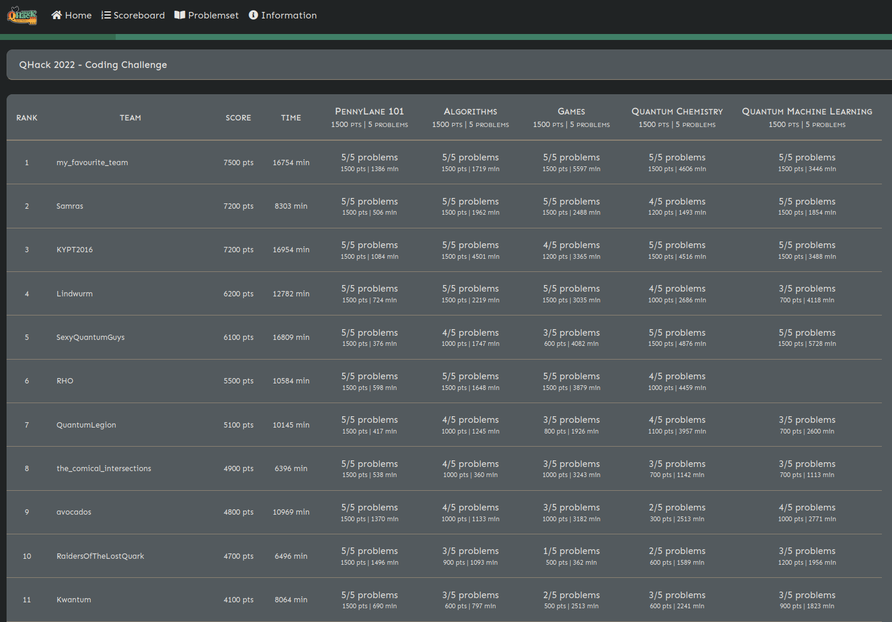

# QHack 2022 Coding Challenge of `my_favourite_team`

The [QHack 2022 Coding Challenge (non permanent URL)](https://challenge.qhack.ai) is a challenge that took place between the 14th and the 25th of February.

This repository contains the solutions we submitted. The solutions might have been improved after submission, for example by adding comments or factoring code.

# Leaderboard

We were the first team to finish all the problems (in absolute time):

In the end, we finished at the second place:

<blockquote class="twitter-tweet">
<a href="https://twitter.com/hashtag/QHack2022?src=hash&amp;ref_src=twsrc%5Etfw">#QHack2022</a> Coding Challenges Announcement 📣   643700 points have been scored so far 🤯   Teams that won a power-up ⚡ can expect to receive emails from the QHack team soon.  The board will remain open until Feb 25 — keep solving problems for your chance to win more prizes! <a href="https://t.co/lJs9OOeNBS">pic.twitter.com/lJs9OOeNBS</a>
&mdash; PennyLane (@pennylaneai) <a href="https://twitter.com/pennylaneai/status/1494802309947219977?ref_src=twsrc%5Etfw">February 18, 2022</a></blockquote> 

